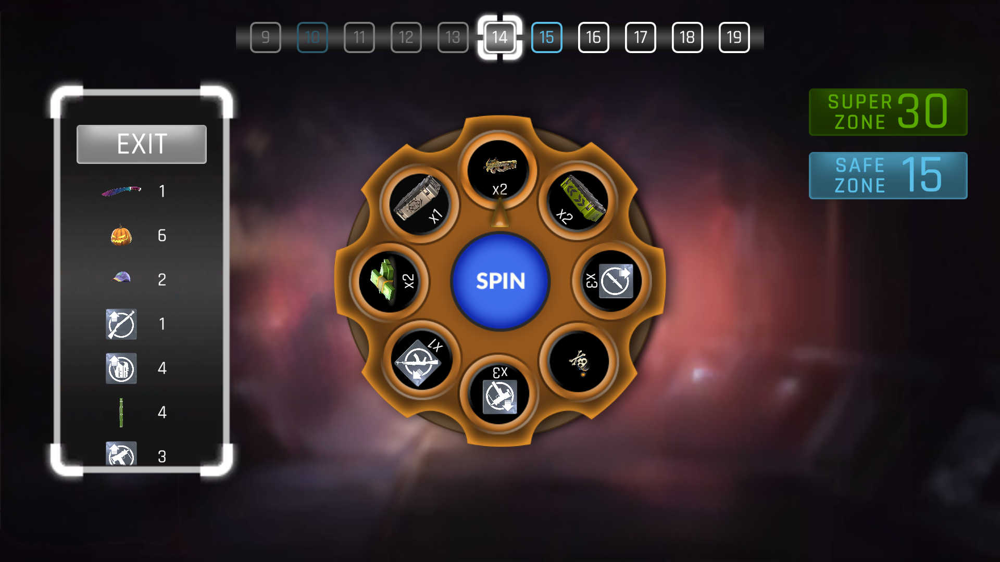
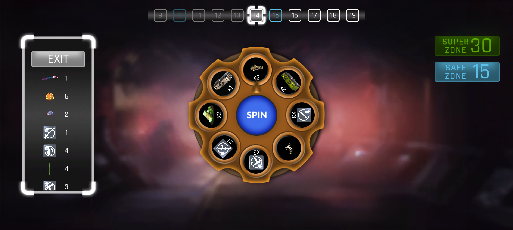
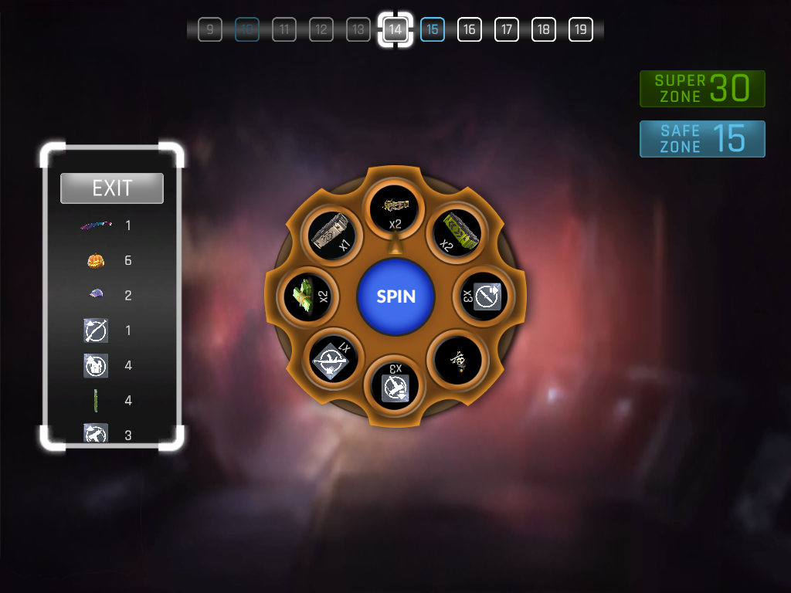
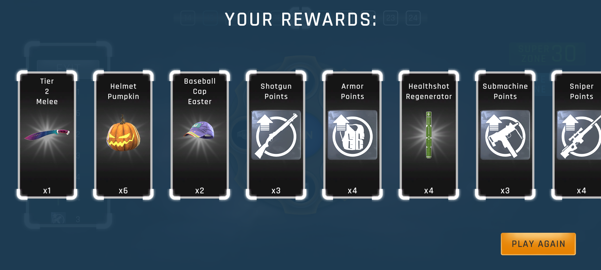
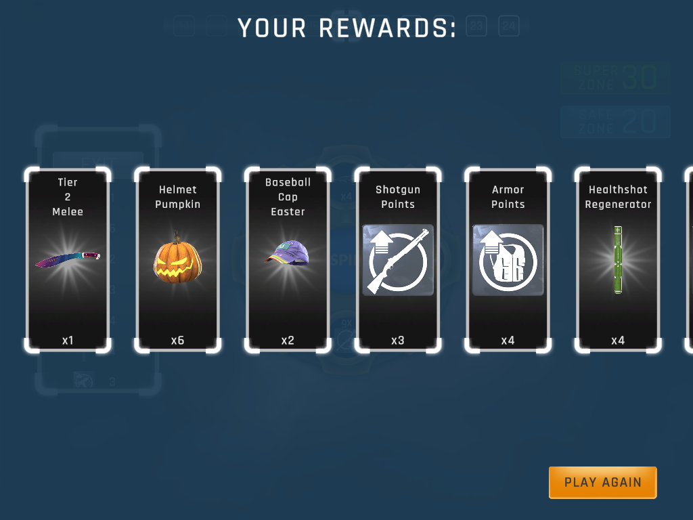
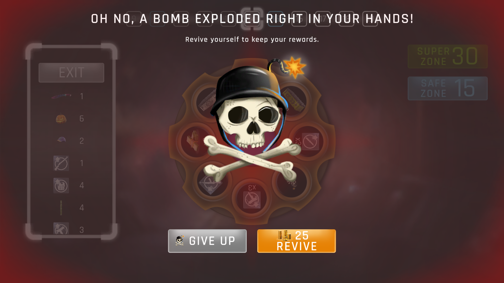
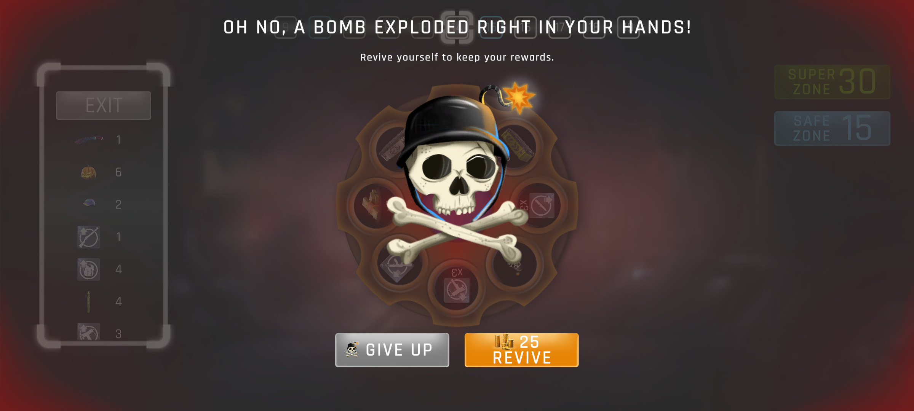
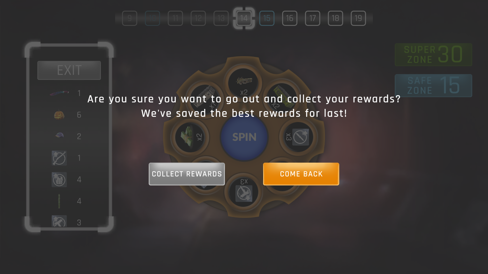
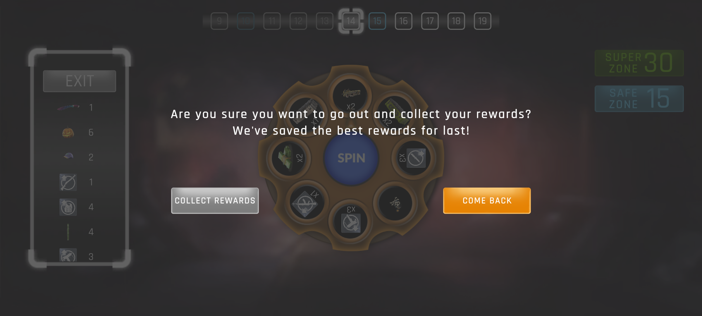
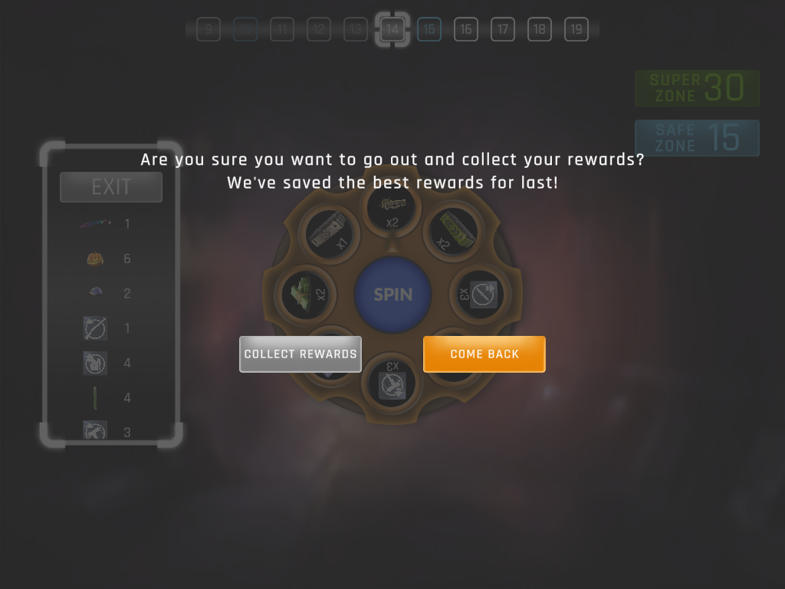

## 🧾 Account Information (Company Games)

| Game           | Username  | User ID          |
|----------------|-----------|------------------|
| Critical Strike | omerozerf | CD4E2D1A0B6A200  |
| Polygun Arena   | omerozerf | B34B2DB5BF7167AB |

# Wheel Rewards Progression Game

Spin tabanlı, zone ilerlemeye dayalı bir Unity oyunu.  
Oyuncu çarkı çevirerek ödüller toplar, ilerledikçe daha değerli ödüllerle karşılaşır ve bombalardan kaçınarak envanterini genişletir.  
Oyun; Wheel sistemi, Zone progression, Slot/Reward üretimi, Card envanteri ve animasyonlu UI yapıları üzerine kuruludur.

---

## 🎮 Playable Demo

👉 **https://omerozerf.itch.io/wheel-of-fortune**

---

## 🎮 Gameplay Preview

| Görsel | Açıklama |
|-------|----------|
|  | **Gameplay GIF** — Oran: 16:9 |

**Gameplay Video:**  
[Google Drive Video Linki](https://drive.google.com/file/d/1WlAMrHjYNcj1LMWZfsJxsEpaWDi5QpxJ/view?usp=sharing)

---

## 📸 Screenshots

### 📌 In-Game Screens

| 16:9 | 20:9 | 4:3 |
|------|------|-----|
|    Oran: 16:9 |    Oran: 20:9 |    Oran: 4:3 |

---

### 📌 Rewards Screens

| 16:9 | 20:9 | 4:3 |
|------|------|-----|
|    Oran: 16:9 |    Oran: 20:9 |    Oran: 4:3 |

---

### 📌 Bomb / Lose Screens

| 16:9 | 20:9 | 4:3 |
|------|------|-----|
|    Oran: 16:9 |    Oran: 20:9 |    Oran: 4:3 |

---

### 📌 Exit Screens

| 16:9 | 20:9 | 4:3 |
|------|------|-----|
|    Oran: 16:9 |    Oran: 20:9 |    Oran: 4:3 |

---

## 🚀 Özellikler

### Wheel Sistemi
- Tüm Wheel parametreleri Inspector üzerinden ayarlanabilir.
- WheelSlotController, her slice için SlotSO seçimini belirler.
- allowedSlots boşsa → global slot listesinden rastgele.
- allowedSlots doluysa → sadece listedeki SlotSO’lardan seçim.
- 8 slot tamamlandıktan sonra rastgele bir slota **tek bomba** atanır.
- Safe/Super Zone bölgelerinde bomba atanmaz.
- Zone power arttıkça rarity ağırlıkları yükselir.

### Component & Event Akışı
- OnSlotsChanged → Slotlar yenilenir.
- OnWheelStopped → Çark durduğu anda slice index’i verir.
- OnSlotSelected / OnBombSelected → Sonuç UI ve envantere işlenir.

### Ödül Sistemi
- Common / Rare / Epic / Legendary rarity ağırlıkları otomatik hesaplanır.
- SlotSO tüm ödül meta bilgilerini içerir.
- Zone ilerledikçe ödül miktarları artar.

### Zone Sistemi
- Sonsuz yan kaydırmalı zone yapısı.
- Ekran dışına çıkan zone geri dönüştürülür.
- Safe/Super Zone interval değerleri GameCommonVariableManager’dan alınır.
- UI renkleri zone tipine göre değişir.

### Card Sistemi
- Yeni ödül için Card oluşturulur.
- Aynı ödül gelirse count artar.
- VFX: scatter → move → fade.
- Tüm efektler ObjectPool ile yönetilir.

### UI & Screen Sistemi
- Win/Lose/Rewards/Exit ekranları CanvasGroup fade ile gösterilir.
- Bomb seçildiğinde kırmızı glow animasyonu devreye girer.
- Tüm UI butonları bağımsız controller yapısına sahiptir.

### Object Pooling
- UI efekt prefabları için performanslı pool sistemi.
- DOFade/DOMove sonrası otomatik despawn.

### Kod Düzeni
- Unity eventleri en üstte
- Private fonksiyonlar ortada
- Public API en altta
- Tutarlı camelCase/PascalCase
- SerializeField private alanlar
- OnValidate ile güvenli kontrol

---

## 🧩 Mimari Akış

1. Oyun başlar → Zone’lar oluşturulur.
2. Spin butonu → Çark döner, hizalanır.
3. Çark durur → Slot belirlenir.
4. Ödül işlenir → Efekt + Card güncellemesi.
5. Zone ilerler → WheelSlotController yeni slotları oluşturur.

---

## 🗂 Proje Yapısı

WheelSystem/  
CardSystem/  
SlotSystem/  
ZoneSystem/  
ZoneInfoSystem/  
ScreenSystem/  
ButtonSystem/  
ObjectPoolSystem/  
Managers/  

---

## 🕹 Nasıl Oynanır?

- Spin → Çark döner  
- Bomb → Lose  
- Ödül → Kart envanterine eklenir  
- Zone ilerledikçe ödüller güçlenir  
- Safe Zone → bomba yok  
- Super Zone → yüksek rarity  
